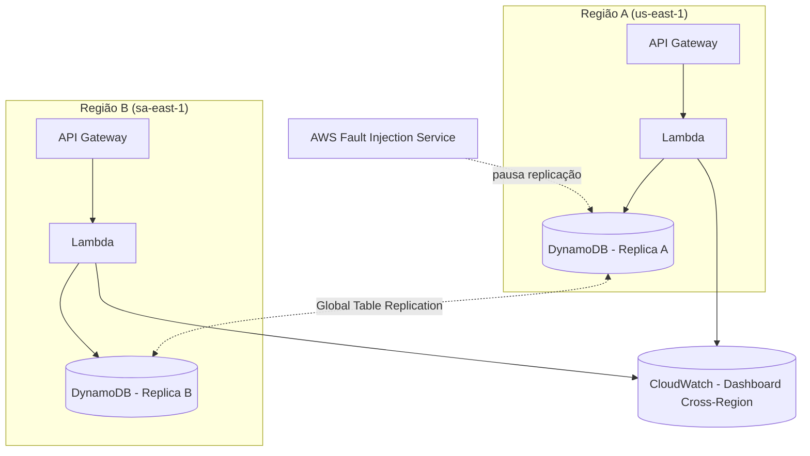
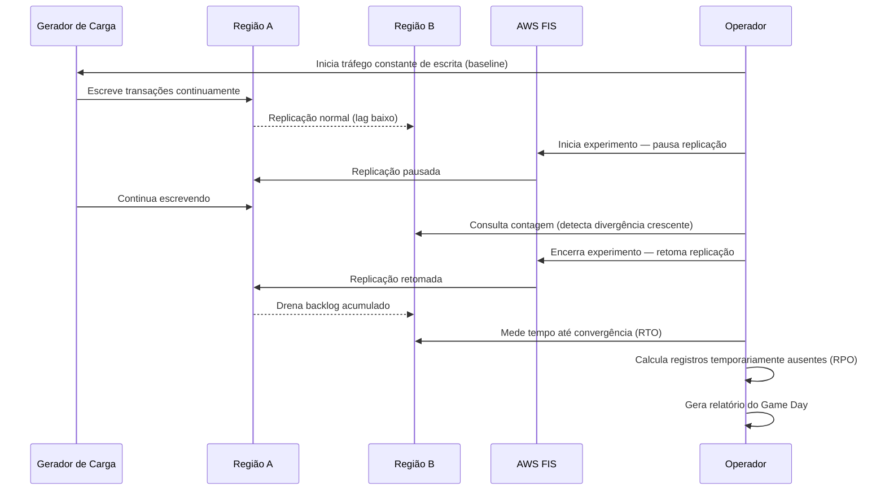
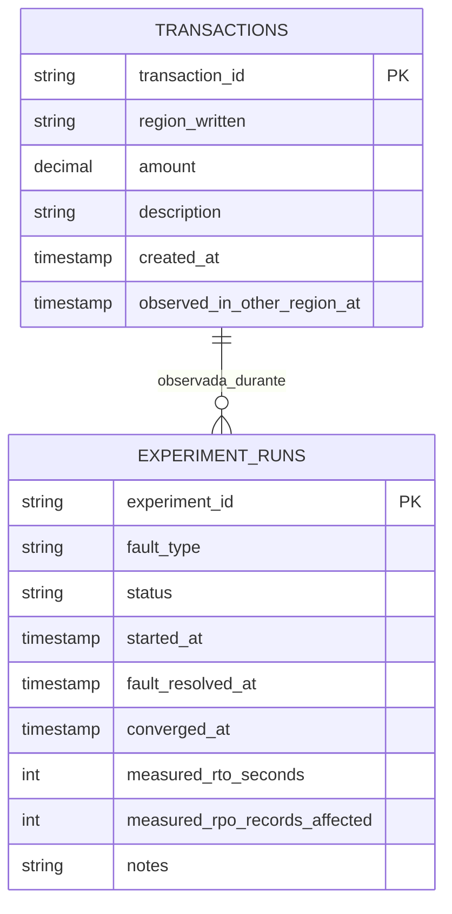

# 🔬 Projeto 7 — Laboratório de Resiliência Multi-Região com Chaos Engineering

> Um serviço de transações implantado em **ativo-ativo** em duas regiões AWS, usando DynamoDB Global Tables. O AWS Fault Injection Service **quebra a replicação de propósito** para medir RTO e RPO reais — não estimados.

---

## Por Que Este Projeto Existe

A maioria dos portfólios mostra um diagrama de arquitetura multi-região e assume que ela é resiliente. Este projeto vai além: **quebra a arquitetura de propósito e mede o que realmente acontece**. Times de SRE chamam isso de "Game Day" — a diferença entre "eu implantei isso" e "eu sei que isso funciona porque testei".

## Arquitetura



### Fluxo do Experimento



## Stack Tecnológica

| Componente | Tecnologia |
|---|---|
| **Regiões** | `us-east-1` (primária) + `sa-east-1` (secundária) |
| **Dados** | DynamoDB Global Tables (V2, PAY_PER_REQUEST) |
| **Compute** | AWS Lambda (Python 3.12) + API Gateway HTTP API |
| **Chaos** | AWS Fault Injection Service — `aws:dynamodb:global-table-pause-replication` |
| **Observabilidade** | CloudWatch Dashboard cross-region consolidado |
| **IaC** | Terraform com multi-provider (módulo regional reutilizável) |
| **Carga** | Python script com `asyncio` + `aiohttp` |

## Pré-requisitos

- [Terraform](https://www.terraform.io/downloads) ≥ 1.5.0
- [AWS CLI v2](https://docs.aws.amazon.com/cli/latest/userguide/getting-started-install.html) configurado com credenciais
- Python 3.12+
- Conta AWS de **sandbox/teste** (nunca produção!)

## Guia de Deploy

### 1. Clone e configure

```bash
cd projeto-7-chaos-engineering

# Configure as credenciais AWS (se ainda não fez)
aws configure

# Ajuste as variáveis em terraform.tfvars
# IMPORTANTE: substitua o email de notificação de budget
```

### 2. Deploy da infraestrutura

```bash
cd terraform

# Inicializa os providers e módulos
terraform init

# Verifica o plano de execução
terraform plan

# Aplica a infraestrutura nas duas regiões
terraform apply
```

### 3. Anote os outputs

```bash
terraform output
# api_endpoint_region_a = "https://xxx.execute-api.us-east-1.amazonaws.com"
# api_endpoint_region_b = "https://xxx.execute-api.sa-east-1.amazonaws.com"
# fis_experiment_template_id = "EXTxxxxxxxxxxxx"
```

### 4. Teste rápido

```bash
# Health check
curl $(terraform output -raw api_endpoint_region_a)/health
curl $(terraform output -raw api_endpoint_region_b)/health

# Enviar uma transação
curl -X POST $(terraform output -raw api_endpoint_region_a)/transactions \
  -H "Content-Type: application/json" \
  -d '{"amount": 100.50, "description": "teste"}'

# Verificar contagem
curl $(terraform output -raw api_endpoint_region_a)/transactions/count
curl $(terraform output -raw api_endpoint_region_b)/transactions/count
```

## 🎮 Guia do Game Day

### Preparação

1. **Configure alarmes de budget** — verifique que os alarmes de orçamento estão ativos no console AWS
2. **Abra o CloudWatch Dashboard** — use a URL do output `cloudwatch_dashboard_url`
3. **Instale as dependências do gerador de carga**:
   ```bash
   cd loadgen
   pip install -r requirements.txt
   ```

### Execução

#### Passo 1: Registre o experimento (ANTES de disparar o FIS)

```bash
curl -X POST $(terraform output -raw api_endpoint_region_a)/admin/experiments \
  -H "Content-Type: application/json" \
  -d '{
    "fault_type": "pause-replication",
    "notes": "Game Day 1 — baseline 1 txn/s por 5 min, pausa de 5 min"
  }'
# Anote o experiment_id retornado!
```

### Opção A: Execução 100% Automatizada (Recomendado — Chaos as Code)

Com a infraestrutura no ar, você pode rodar todo o Game Day com um único comando. O script gerencia a carga, aciona o FIS via Boto3, monitora o tempo de convergência e gera o relatório Markdown final preenchido:

```bash
python scripts/orchestrate_gameday.py --rate 2 --notes "Simulação de isolamento regional"
```

O script criará automaticamente o arquivo `docs/gameday-report-[TIMESTAMP].md` com todos os dados medidos reais!

---

### Opção B: Execução Manual Passo a Passo

#### Passo 1: Registre o experimento (ANTES de disparar o FIS)

```bash
curl -X POST $(terraform output -raw api_endpoint_region_a)/admin/experiments \
  -H "Content-Type: application/json" \
  -d '{
    "fault_type": "pause-replication",
    "notes": "Game Day 1 — baseline 1 txn/s por 5 min, pausa de 5 min"
  }'
# Anote o experiment_id retornado!
```

#### Passo 2: Inicie o gerador de carga

```bash
python loadgen/load_generator.py \
  --region-a-url $(terraform output -raw api_endpoint_region_a) \
  --region-b-url $(terraform output -raw api_endpoint_region_b) \
  --rate 1 \
  --duration 600
```

#### Passo 3: Dispare o experimento no FIS

```bash
# Via AWS CLI
aws fis start-experiment \
  --experiment-template-id $(terraform output -raw fis_experiment_template_id) \
  --region us-east-1

# Ou via Console AWS: FIS → Experiment templates → Start experiment
```

#### Passo 4: Observe no dashboard

- Acompanhe o `ReplicationLatency` subir
- Observe a divergência crescente entre as contagens das regiões
- O gerador de carga mostra a divergência em tempo real no terminal

#### Passo 5: Após o FIS encerrar (ou manualmente)

```bash
# Marque o experimento como resolvido
curl -X POST $(terraform output -raw api_endpoint_region_a)/admin/experiments/{EXPERIMENT_ID}/resolve
```

#### Passo 6: Obtenha o relatório

```bash
curl $(terraform output -raw api_endpoint_region_a)/admin/experiments/{EXPERIMENT_ID}/report | python -m json.tool
```

## API Reference

| Método | Rota | Descrição |
|---|---|---|
| `POST` | `/transactions` | Registra uma transação (`{ amount, description }`) |
| `GET` | `/transactions/count` | Contagem local ou cross-region (`?cross_region=true`) |
| `POST` | `/admin/experiments` | Registra início de um experimento com baseline de ambas as regiões |
| `POST` | `/admin/experiments/{id}/resolve` | Marca resolvido e calcula RTO/RPO reais comparando as duas regiões |
| `GET` | `/admin/experiments/{id}/report` | Relatório completo do experimento com status ao vivo |
| `GET` | `/health` | Diagnóstico de saúde e conectividade cross-region |

## Modelo de Dados



## Definições: RTO e RPO

- **RPO (Recovery Point Objective)**: Número de transações escritas na região A que ainda não haviam aparecido na região B no momento em que a replicação foi retomada. Medido no **pior instante** da janela de falha, não no início.

- **RTO (Recovery Time Objective)**: Tempo entre a retomada da replicação e o momento em que a contagem de registros nas duas regiões converge novamente.

## Limitações Conhecidas

> **Honestidade sobre o que este teste NÃO prova:**

1. **Pausar replicação ≠ perda total de uma região** — o FIS pausa a replicação entre regiões, mas ambas as regiões continuam operacionais. Uma queda real de AZ/região teria impacto muito mais amplo (DNS, rede, serviços dependentes).

2. **Tráfego sintético ≠ tráfego real** — o gerador de carga produz transações uniformes. Tráfego real tem picos, padrões sazonais e operações heterogêneas.

3. **Dados eventuais** — DynamoDB Global Tables usa "last-writer-wins" para resolução de conflitos. Em cenários com escrita simultânea em ambas as regiões, podem haver conflitos não detectados por este teste.

4. **Latência de rede** — o teste não simula degradação de latência de rede, apenas pausa de replicação. Para simular problemas de rede, combine com o cenário `Cross-Region: Connectivity` do FIS.

## O Que Mudaria Para Produção

Se este fosse um sistema real:

- **Route 53 Application Recovery Controller (ARC)** para failover automático de DNS entre regiões
- **Provisioned capacity com auto-scaling** no DynamoDB em vez de on-demand (custo otimizado para tráfego previsível)
- **Dead Letter Queues (SQS)** para transações que falharam durante a janela de chaos
- **Multi-Region Strong Consistency (MRSC)** no DynamoDB para eliminar o RPO teórico (se disponível e se o trade-off de latência for aceitável)
- **Alarmes de stop condition mais sofisticados** — latência p99, taxa de erros, e métricas de negócio
- **Backend remoto do Terraform (S3 + DynamoDB lock)** para colaboração em equipe

## Custos Estimados

| Recurso | Custo Aproximado (repouso) |
|---|---|
| DynamoDB (2× on-demand, mínimo) | ~$0/mês (free tier cobre uso baixo) |
| Lambda (2× funções, baixo uso) | ~$0/mês (free tier) |
| API Gateway (2× APIs, baixo uso) | ~$0/mês (free tier) |
| CloudWatch (dashboard + métricas) | ~$3/mês |
| FIS (por experimento) | ~$0.10/experimento |
| **Total estimado (sandbox)** | **< $5/mês** |

> ⚠️ Custos aumentam com tráfego real. Os alarmes de AWS Budgets configurados neste projeto notificam em 80% e 100% do limite mensal.

## Limpeza

```bash
cd terraform
terraform destroy
```

## Estrutura do Projeto

```
projeto-7-chaos-engineering/
├── terraform/                          # Infraestrutura como código (Multi-Provider)
│   ├── main.tf                         # Providers + chamadas de módulo
│   ├── variables.tf                    # Variáveis globais com validações
│   ├── outputs.tf                      # Endpoints das APIs e ARNs
│   ├── terraform.tfvars                # Valores padrão
│   ├── backend.tf                      # State backend
│   ├── dynamodb.tf                     # DynamoDB Global Tables V2
│   ├── fis.tf                          # FIS Experiment Template (pause-replication)
│   ├── cloudwatch.tf                   # Dashboard cross-region e alarmes
│   ├── budgets.tf                      # AWS Budgets com limites e notificações
│   └── modules/regional-stack/         # Módulo reutilizável (Lambda + API GW HTTP v2)
│       ├── main.tf
│       ├── variables.tf
│       └── outputs.tf
├── src/lambda/                         # Backend Serverless Python 3.12
│   ├── lambda_function.py              # Handler com leitura e cálculo cross-region
│   └── requirements.txt
├── scripts/                            # Automação e Ciclo de Vida
│   ├── orchestrate_gameday.py          # Orquestrador End-to-End (Chaos as Code)
│   ├── deploy.ps1 / deploy.sh          # Scripts de deploy automatizado
│   └── destroy.ps1 / destroy.sh        # Scripts de teardown seguro
├── loadgen/                            # Gerador de Carga Assíncrono
│   ├── load_generator.py               # Motor asyncio/aiohttp
│   └── requirements.txt
├── docs/                               # Documentação e Templates
│   └── gameday-report-template.md      # Template formal de Game Day
└── README.md                           # Documentação técnica e guia operacional
```

---

## Relatório do Game Day

> **Seção para ser preenchida após a execução real do experimento.**
> Use o template em `docs/gameday-report-template.md`.

### Game Day #1 — [DATA]

| Métrica | Valor Medido |
|---|---|
| Tipo de Falha | `pause-replication` |
| Duração da Falha | ___ minutos |
| **RTO (medido)** | ___ segundos |
| **RPO (medido)** | ___ registros |
| Transações Enviadas | ___ |
| Divergência Máxima | ___ registros |

**O que aconteceu:** _Descreva o comportamento observado_

**O que surpreendeu:** _Algum comportamento inesperado?_

**O que mudaria:** _Melhorias na arquitetura baseadas nos resultados_

---

_Construído como demonstração de maturidade arquitetural e prática de SRE Game Day — não como tutorial passo-a-passo._
